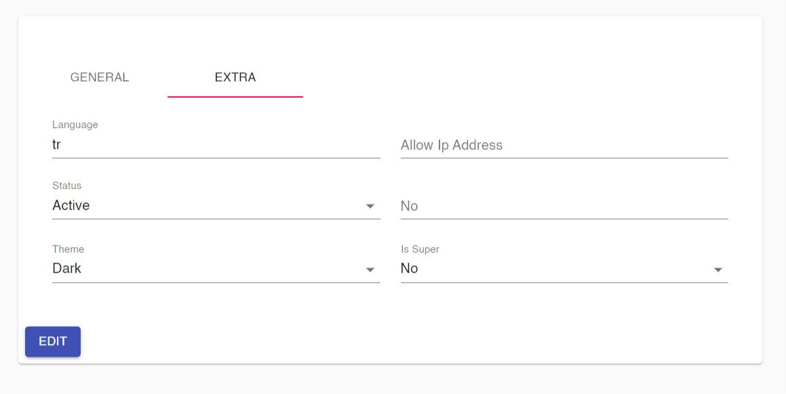

## onka-react-admin-core

Simple admin panel based on React and  Material UI. 

- [Documentation](docs)

## sample project

Check [onka-react-admin](https://github.com/onka13/onka-react-admin) 

## screenshots

### Login

### Dashboard

### Search

### Update & Insert

### Roles
