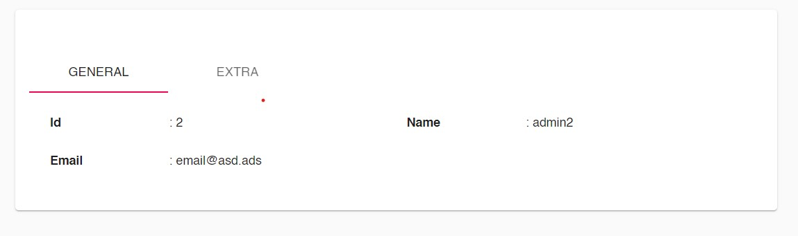

## Detail Page



```
function Detail(params: any) {
  let fields = pageConfig.fields.filter(x => x.displayInDetail);
  return DetailPage({ pageConfig, fields });
}

```

### Using Tabs

```
function Detail(params: any) {
  let fields = getFields('detail');
  return DetailPage({
    pageConfig: pageConfig,
    tabs: [
      {
        label: 'General',
        fields: fields.slice(0, 3),
      },
      {
        label: 'Extra',
        fields: fields.slice(3),
      },
    ],
  });
}
```

