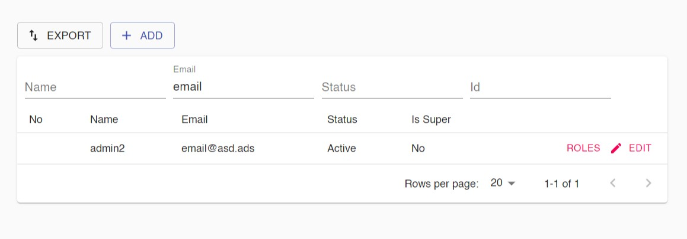

## Search Page



```
function Search(params: any) {
  let gridFields = pageConfig.gridFields;
  let filterFields = pageConfig.filterFields;
  return SearchPage({ pageConfig, gridFields, filterFields, rowActions: SearchRowActions });
}
```

### Using Bulk Actions

```
function SearchRowActions(props: GridRowExtraActionProp) {  
  return (
    <>
      <Button size="small" variant="text" color="secondary">
        Roles
      </Button>
    </>
  );
}

function SearchBulkActions(props: GridBulkActionProp) {
  return <>
    <Button size="small" variant="text" color="secondary">
        Delete selected rows
      </Button>
    </>;
}

function Search(params: any) {
  let gridFields = pageConfig.gridFields;
  let filterFields = pageConfig.filterFields;
  return SearchPage({ pageConfig, gridFields, filterFields, rowActions: SearchRowActions, bulkActions: SearchBulkActions });
}

```