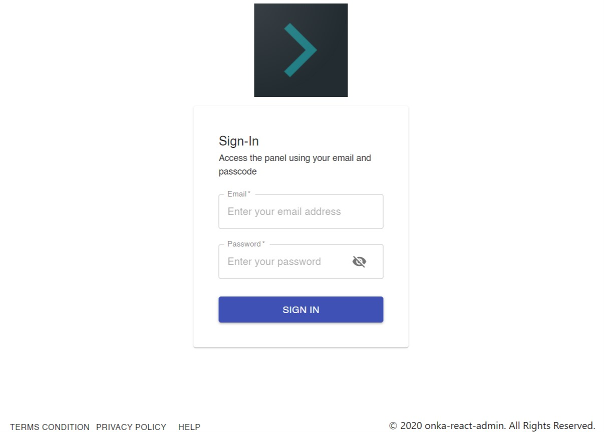

## Login



Login component. 

```
<Admin
    ...
    login={{
        footer: <PublicFooter />,
        logo
    }}
></Admin>
```
Use your own login component. 

```
<Admin
    ...
    loginComponent={<MyLogin />}
></Admin>
```