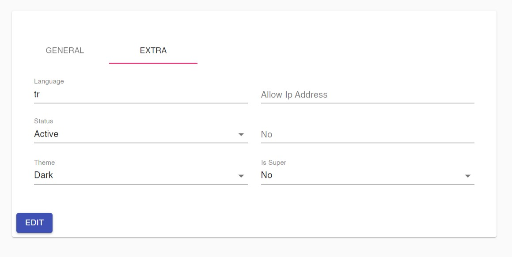

## Update / Insert Page



```
export function getFields(pageType: PageType, prefix?: string) {
  return LibService.instance().filterFields(pageConfig.fields, pageType, prefix);
}

function Upsert(params: any) {
  const { id } = useParams<{ id: any }>();
  const isEdit = !!id;
  let fields = getFields(isEdit ? 'edit' : 'create');
  return UpsertPage({ pageConfig, fields, initialValues });
}
```

### Using Tabs

```
function Upsert(params: any) {
  const { id } = useParams<{ id: any }>();
  const isEdit = !!id;
  let fields = getFields(isEdit ? 'edit' : 'create');
  var email = fields.find((x) => x.name == 'email');
  if (email) {
    email.editComponent = function (props: InputComponentProp) {
      return CustomComponents.InputComponent({ ...props, readonly: true });
    };
  }
  return UpsertPage({
    pageConfig,
    initialValues,
    tabs: [
      {
        label: 'General',
        fields: fields.slice(0, 3),
      },
      {
        label: 'Extra',
        fields: fields.slice(3),
      },
    ],
  });
}
```

